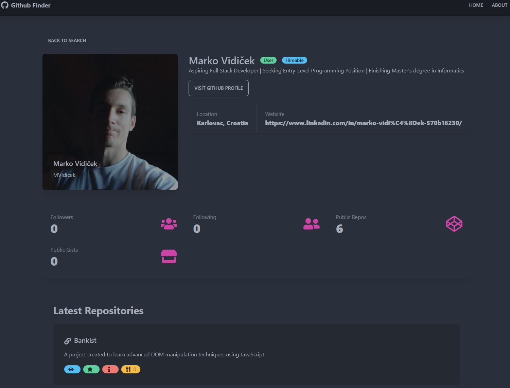

## Github Finder App </br>
App to search Github users and display their info. Created with React, using Tailwind CSS and DaisyUI.

<p align="center">
  
</p>

## Usage

Create a .env file containing: </br>
**REACT_APP_GITHUB_URL = "https://api.github.com" </br>
REACT_APP_GITHUB_TOKEN = "your_githup_api_token_here"** </br>

You can use the Github API without a personal token, but if you want to use your token, add it to the .env file

Learn how to create a token [here](https://docs.github.com/en/authentication/keeping-your-account-and-data-secure/creating-a-personal-access-token)

### Install Dependencies

```
npm install
```

### Run

```
npm start
```

## Credits

https://www.udemy.com/course/react-front-to-back-2022/ </br>
Brad Traversy - React Front To Back 2022
